<p align="center"><a href="https://metersphere.io"></a></p>
<h3 align="center">新一代的开源持续测试工具</h3>
<p align="center">
  <a href="https://www.gnu.org/licenses/gpl-3.0.html"></a>
  <a href="https://www.codacy.com/gh/metersphere/metersphere/dashboard?utm_source=github.com&amp;utm_medium=referral&amp;utm_content=metersphere/metersphere&amp;utm_campaign=Badge_Grade"></a>
  <a href="https://github.com/metersphere/metersphere/releases"></a>
</p>
<hr />

MeterSphere 是新一代的开源持续测试工具，支持用例管理，用例评审，接口自动化测试和报告等功能，本项目主要是对DB自动化测试的可视化进行探索。

-   **SQL执行可视化**：直接页面直接执行SQL语句并观测结果
-   **SQL自动化用例管理**：仿照MS对接口自动化用例的管理，支持对DB用例进行管理。
-   **DB多协议支持**：通过适配器模式支持多种协议（目前仅改造支持了mysql协议，未来会支持多种协议）

# metersphere自动化框架核心功能介绍
官方文档：[MeterSphere 文档](https://metersphere.io/docs/v3.x/)。

metersphere平台（下文简称ms平台）简介：支持HTTP接口测试的可视化框架，拥有强大的自动化接口能力，如支持各类请求参数，强大的参数化功能，方便直观的结果校验等等

但我觉得ms最好用的地方在于数据UI可视化以及方便快捷的结果校验点选操作，这极大的提高了编写和管理接口自动化的效率。

### 数据可视化:

支持接口调试，接口定义（用例管理），也支持场景串联，对于HTTP测试来说，方便按照模块/服务等对HTTP接口进行管理，也支持各种基础环境的选择和各种定时任务操作

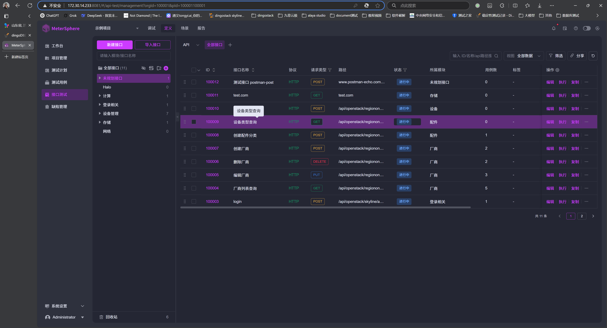

### 结果校验点选:

对于结果确定的HTTP接口响应断言，ms支持UI调试+点选的操作，以json为例，支持点选不同级别的json结构体进行校验
支持接口调试，接口定义（用例管理），也支持场景串联，对于HTTP测试来说，方便按照模块/服务等对HTTP接口进行管理，也支持各种基础环境的选择和各种定时任务操作

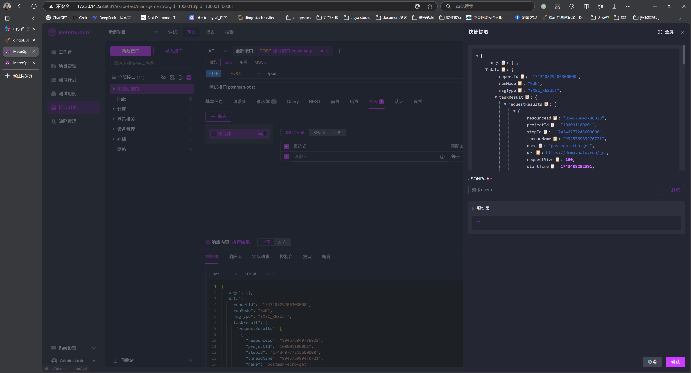

### 开发思路，风险点以及其他

**整体思路:** 可以基于ms已有的部分前端页面和后端逻辑（比如用例管理，目录管理等完全可以微调后复用），但是需要对SQL的全链路进行适配改造

**风险:** ms是开源项目，开源协议是GPLv3，可以商用但必须参考GPLv3 条款开源二次开发的源代码–这一点基本无风险

**限制:** 开源ms存在一些限制，比如限制用户数量，部分执行器不开源无法复用逻辑等，但对于DB自动化测试来说，这些都是要重新开发的，也不算是问题。

**开发内容:** 需要开发从SQL输入，调试，结果展示，用例管理，报告存储等关于SQL执行全流程的功能，其中用例管理，报告存储等基础功能可以从HTTP测试代码微调后复用，但结果校验及用例保存结构等需要重新设计

# ms平台部署和体验
ms平台整体架构：核心模块的交互方式见图中箭头  
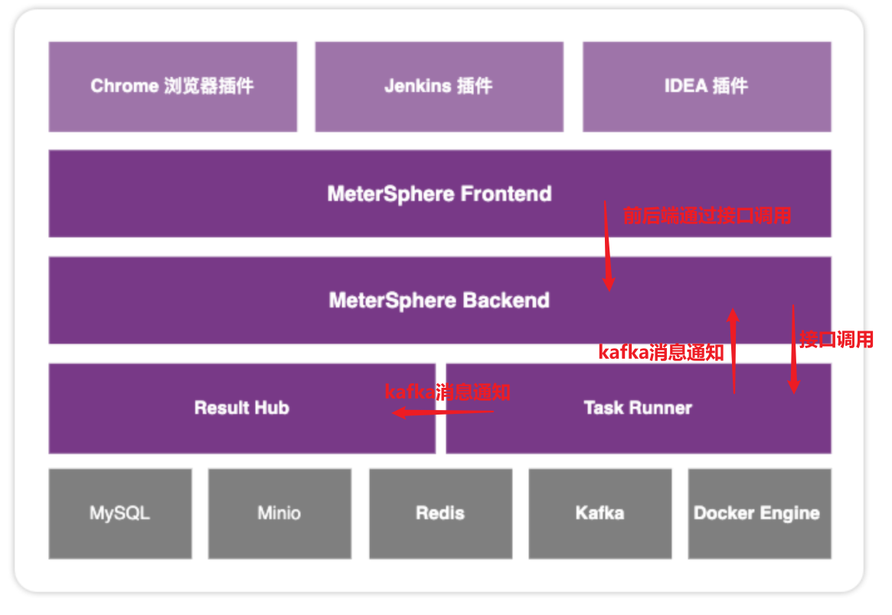
**metersohere frontend:** ms平台的前端项目，基于vue3开发，UI组件使用的为arco design，风格统一  

**metersphere backend:** ms的后端项目，jdk21，springboot  

**task runner:** 专门用户测试用例执行的服务，代码不开源，基于jmeter执行格式，可以实现http接口调用，接口用例执行完成后，主要通过kafka消息通知其他组件，付费后可无限扩展数量提高执行速度  

**result hub:** 专门用户测试结果更新的服务，代码不开源，在监听到task runner发出的kafka消息后，会修改数据库中关于report和test-plan相关的表，更新用例执行状态
虽然task runner和result hub两个组件不开源，但是通过下载其可执行jar包反编译后，也可以推理其处理过程，如result hub中如何写入的数据

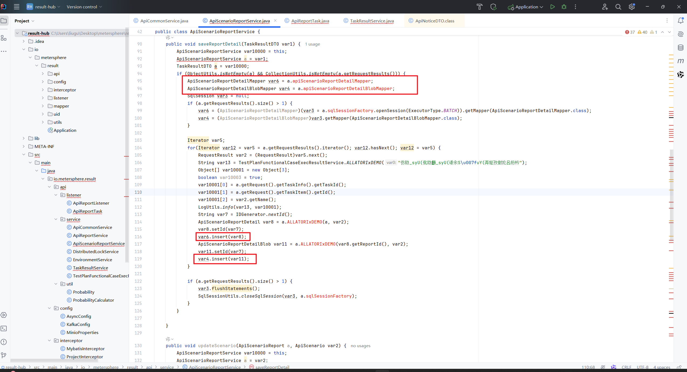

### 快速部署
因为ms需要redis kafka minio等基础中间件，自己部署这些中间件也容易带来版本不一致的问题，尤其是mysql部署需要修改比较多的启动参数，最简单的方式是先部署一个allinone的环境，部署完成后上图中各模块就分别部署在不同的docker容器中了，此时可以将frontend和backend两个容器删除，替代为自己的服务就可以，如下图  

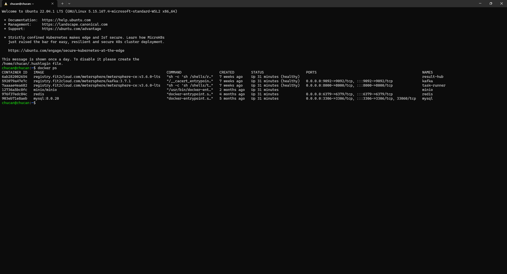

此时再打包和部署本项目对应的前端服务即可，部署后登录，首次登录用户名和密码 admin metersphere  

几个基础中间件作用：  
**mysql：** 用户信息，用例信息，测试报告等非文件的所有内容都保存在数据库中  
**minio：** 支持HTTP测试中的文件存储，比如需要测试一个文件上传的接口，就需要minio支持文件的保存和读取功能  
**redis：** 用来缓存测试执行数据，所有待执行的用例会转为jmeter的xml格式，存储在redis中  
**kafka：** 测试任务消息通知和结果消息同步  
**docker：** 如果不用allinone部署方式的话，docker也不是必须的，但建议使用  

# 如何突破ms平台对于用户登录数量的限制
目前ms开源代码的限制主要影响是仅能创建一个组织+用户，其他限制不影响数据库的测试，虽然勉强能用但不好用，比如未来统计每个人用例数量的时候也没办法区分  
探索代码发现用户数量创建限制是通过一个内置名为CFTVolumeLimitation的bean来限制，该bean注册后可以实现在接口请求前增加拦截器（Interceptor）步骤，这一点是基于spring的框架实现的，想要绕开这个限制，可以将该bean从注册列表中删掉即可，对应代码如下
```java
@Configuration
public class CrackConfig {
    @Bean
    public static BeanDefinitionRegistryPostProcessor registryPostProcessor() {
        return new BeanDefinitionRegistryPostProcessor() {
            @Override
            public void postProcessBeanDefinitionRegistry(BeanDefinitionRegistry registry) throws BeansException {
                registry.removeBeanDefinition("CFTVolumeLimitation");
            }

            @Override
            public void postProcessBeanFactory(ConfigurableListableBeanFactory beanFactory) throws BeansException {
            }
        };
    }
}
```
创建一个bean，基于 BeanDefinitionRegistryPostProcessor ，可以实现在bean定义列表加载注册完，但是spring启动前，将CFTVolumeLimitation类再移除掉，这样项目启动后就没有用户数量注册的限制了  
不过ms开源部分也并未提供注册用户的接口，所以新增用户可以通过插入数据库来实现
# 在写第一行代码前，需要考虑的事情
**a)**  由于SQL测试与HTTP接口测试完全不同，因此这部分逻辑需要完整重写，HTTP接口测试的部分特性可以借鉴
HTTP测试的几个模块，见下图  
1. **调试：** 可以像浏览器或者postman一样，调用接口，查看请求和响应，功能如其名，用于接口的调试  
2. **定义：** 在ms的HTTP测试中，定义分为两层，上层是接口的定义，可以定义接口的基础url，必要参数（可以通过变量代替），基础响应code，定义层可以是非执行状态；下层是接口的实际用例，但必须基于上层定义的url和method。这两层定义在代码层面的枚举值分别为API和API_CASE，对于DB测试来说，应该仅需要一层就可以（SQL）  
3. **场景：** 可以实现将近似的测试用例进行聚合（如同一个接口的不同场景），也可以实现不同的用例进行聚合（比如不同接口串行化执行以实现一个场景）  
4. **报告：** 测试报告，功能如其名

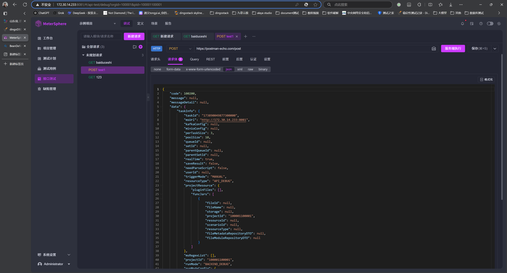

测试报告截图：

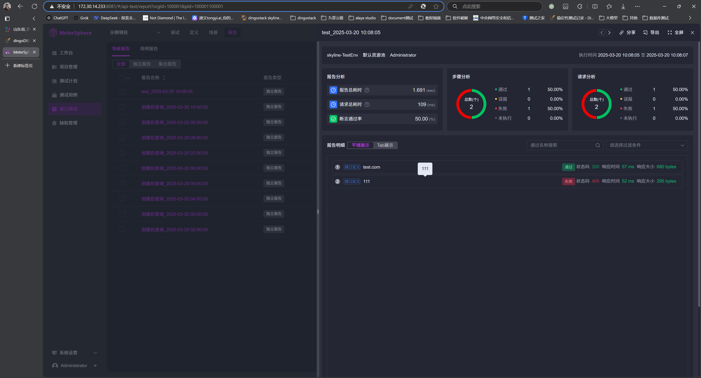

SQL测试也可以参考HTTP接口的功能，同样分为四部分：调试，定义，场景，报告，可以在调试部分加一个mysql命令行操作

**b)**  考虑到所测数据库支持多种协议，因此在代码设计层需要考虑扩展

目前对于扩展性的考虑主要在后端，假设需要SQL执行支持mysql协议，pg协议，应该怎么办？参考另一个优秀开源项目 [chat2db](https://github.com/codePhiliaX/Chat2DB) 项目的实现，设定一个接口，通过dbType类型来调用不同的接口实现SQL执行  

chat2db代码：  
CommandExecutor：SQL执行的核心逻辑

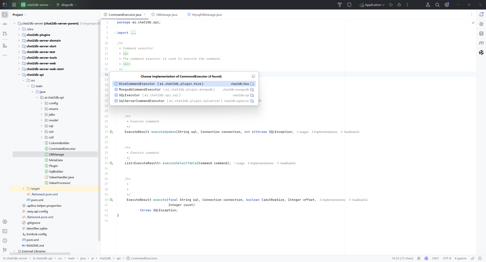

DBManage：用来控制DB连接以及基础操作的核心类

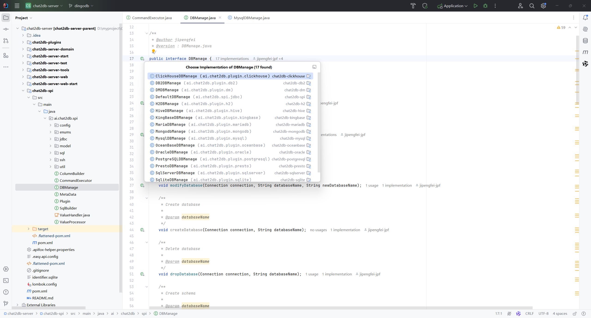

ms平台的基础实现：  
目前只有mysql这一种协议支持，虽然为了快速写个demo没有传递必要参数，但是预留了入口

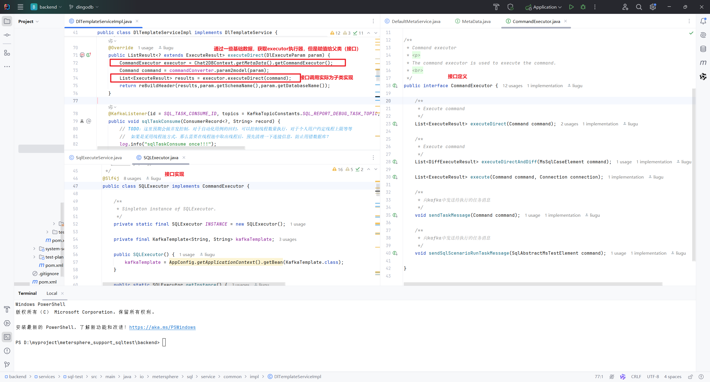

**c)**  对于基础SQL测试，有三种结果体验：table、updateCount，errorMessage，因此需要设计一种结构体，可以支持三种数据的保存与展示

**d)**  与现阶段的测试框架一样，UI界面的测试也应该支持多线程并行，设计思路与http测试一样，也采用第三方服务（类似 task runner）一样，任务的下发和结果的手机都采用kafka消息形式

SQL执行的过程：
1. backend服务在接收到待执行的SQL任务时，将任务（包含任务配置信息和待执行SQL等）转为kafka消息，放到消息队列中  
2. sql-task-runner服务在监听到消息后，解析任务配置信息，执行SQL，完成数据比对，任务完成后再发送结果信息到另一个消息队列中  
3. backend监听到结果消息后，将任务结果同步到数据库和前端页面中

为何要使用消息中间件？

优点：sql-task-runner可以部署多个，如果想要实现更高并发的效果，可以部署多个sql-task-runner服务，理论上可以扩展无限个，不会也不该成为用例执行的瓶颈

缺点：复杂度略有增加，而且如果SQL执行为为串行的话，需要考虑加锁，另外如果kafka有多个partition，也要考虑同一次任务的多个步骤是否要放在同一个partition中（这一点暂不考虑，预期不会有这么大的并发，不需要多partition）

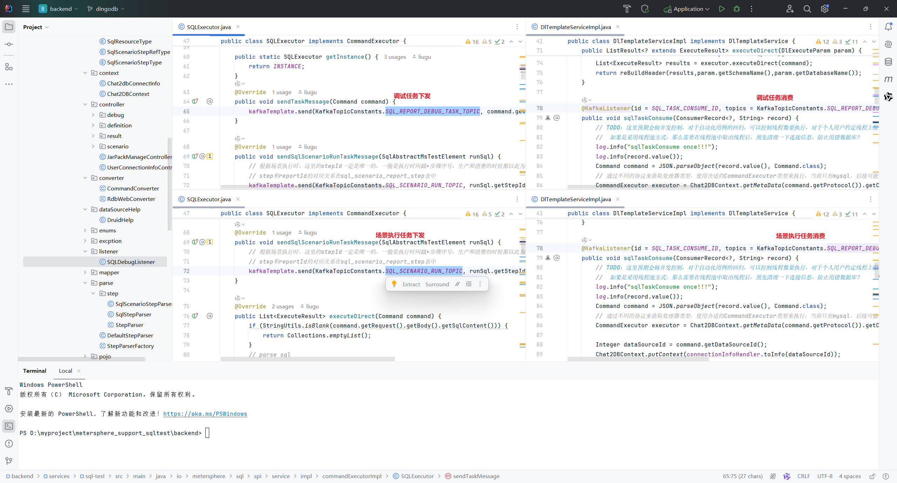

**e)** 与HTTP测试一样，SQL测试应当也支持不同的环境选择，前期demo可以略过这部分，但是未来肯定是要支持

**f)** ms的HTTP测试支持自定义代码实现，这一点可以用来实现默认不支持的比对方法，SQL测试同样也需要不同的比对方法，但是考虑代码实现的复杂度，暂不支持代码自定义，只支持内置方法，参考现有内容至少要支持 equals，contains， similarEquasl(向量值近似相等）等基础方法

# 目前已经实现的demo流程（前端功能展示）
#### 1.SQL调试  
整体布局参考HTTP接口调试，输入SQL后可以获取执行结果  

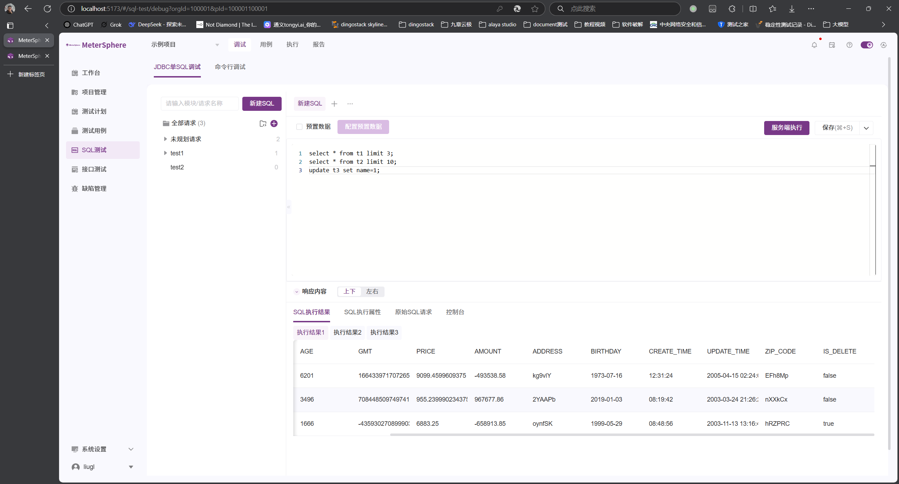

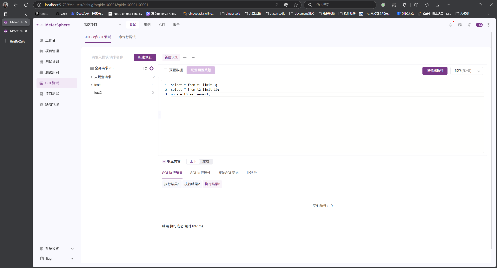

考虑到有时候JDBC的结果并不可靠，因此也可以考虑支持mysql命令行模式，实现了一个linux命令行客户端（后期考虑支持多开窗口）

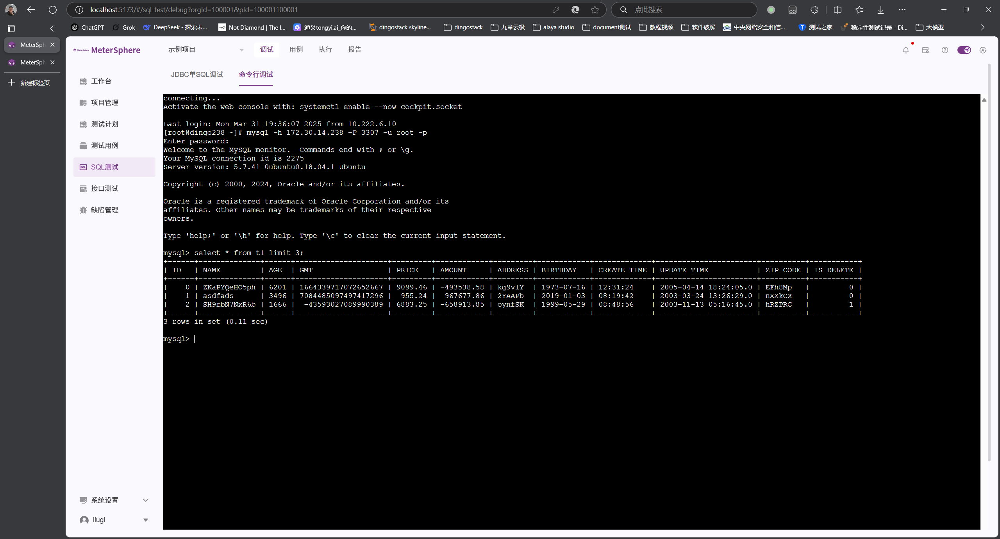

#### 2.SQL用例定义  
SQL调试可以理解为仅保存请求，但是SQL用例就需要保存请求+响应结果
点击执行后，再点击保存，这个时候就可以将秦秋+结果都保存下来  
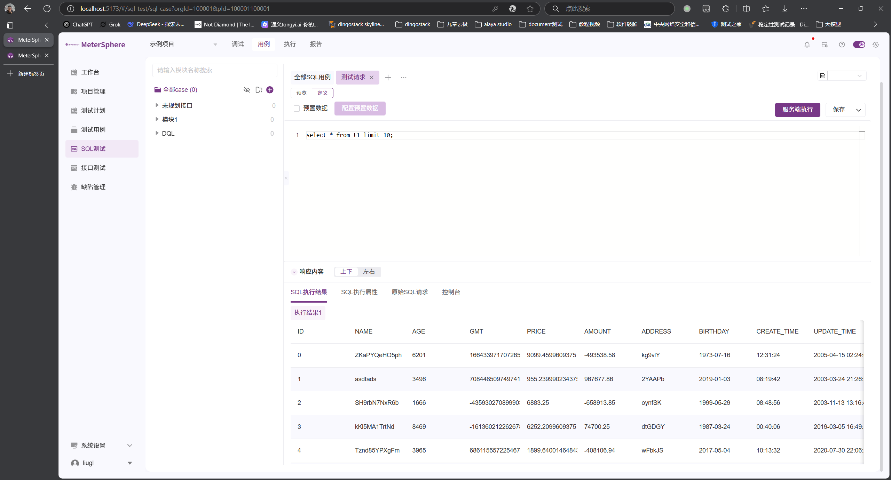
考虑到不同的SQL可能需要不同的比对策略，也需要支持不同的比对方法，如下图
这部分仅为展示，目前仅实现了一种默认的比对策略
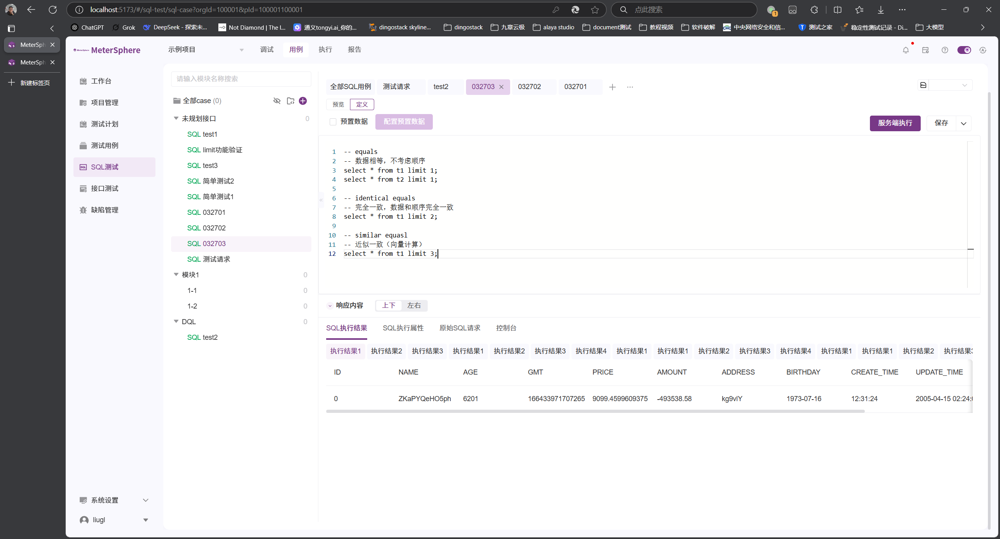

#### 3.SQL执行（场景组合）
在SQL定义中，可以将不同的SQL进行分类，比如DQL可以划分为 时间查询，limit查询，条件查询等等，如何将所有用例汇总在一起执行（手动或自动），可以参考HTTP的步骤添加实现  

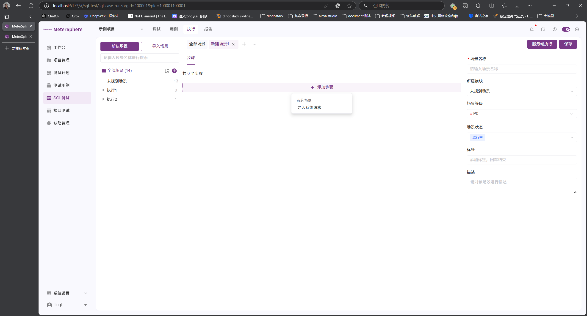

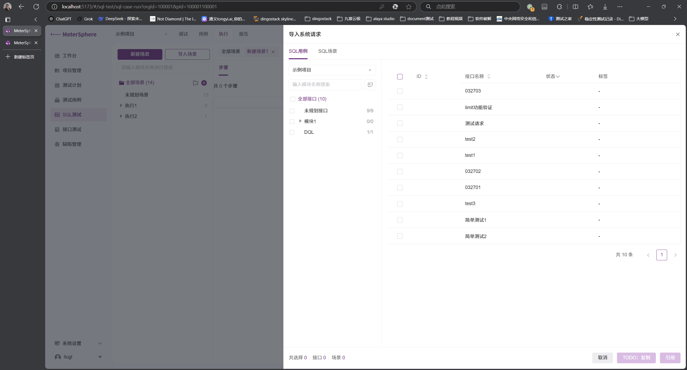

添加完成之后就可以保存并执行，效果如下 

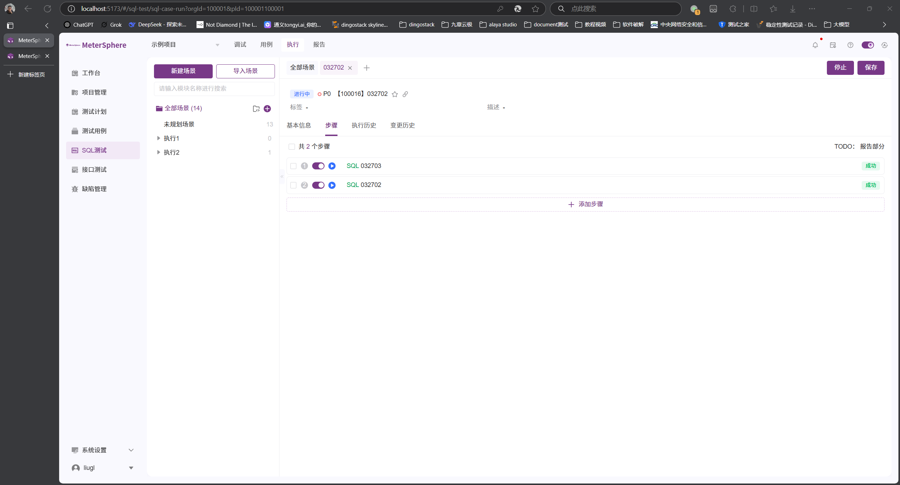

为了方便查看结果也支持hover展示结果 

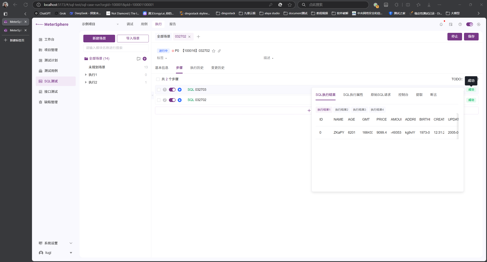

#### 4.测试报告
实现方式与HTTP近似，只是对SQL需要做大量适配，目前报告明细展示稍有问题，不支持详细数据展示  

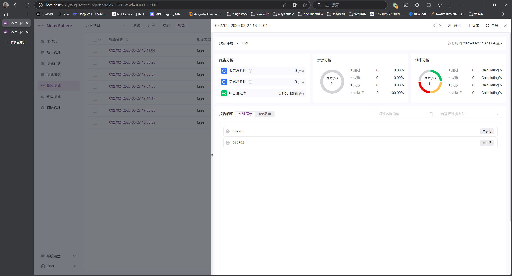

从前端功能看，目前仅实现了流程串行，对于很多细节还需继续开发

# 目前缺点：
#### 1.没有SQL的执行耗时统计
这也是原HTTP接口部分缺失的功能，目前没有HTTP接口或SQL的执行耗时统计曲线
解决办法或规划：  
未来可以考虑将用例的执行耗时收集起来（目前数据已有收集但需要进一步细化），可以查看某个SQL用例一段时间的耗时曲线，或查看cicd的整体耗时曲线，方便对性能有个参考
#### 2.不支持在前端自定义结果比对方法（前端直接写比对代码）
考虑到SQL执行比对方法并不需要那么多，可能十个比对方法就足够了，暂不考虑支持，有需要的话直接需改backend代码就行了
#### 3.目前sql-task-runner写在了backend服务内未做抽离，无法扩展
因为一开始没有考虑到模块化，后面再考虑拆分为一个单独的服务（需要注意串行任务并发锁等问题）
#### 4.sdk和事务不支持
根据目前事务的用例，可以考虑迁移，事务支持的方式也比较简单（支持事务在同一线程内操作即可），对于SDK估计目前无法支持，需要通过java间接支持conda虚拟环境操作，或者考虑再启动一个python的api服务，但是流程就更复杂了，以后再考虑
